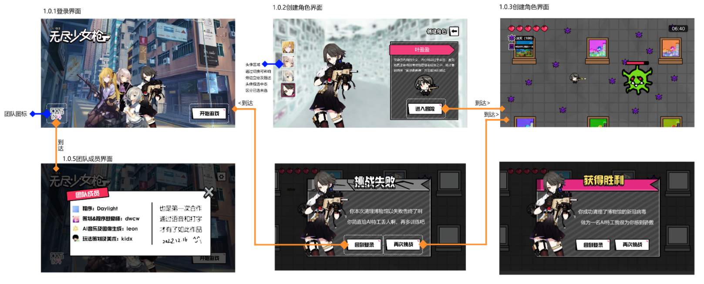

# 无尽少女枪(InfiniteGirlsShocking)-COSIN4

作品已经上传视频，[InfiniteGirlsShocking](https://www.bilibili.com/video/BV1kG4y1g7aY/?share_source=copy_web&vd_source=e71966b84faf5874c21ed098ab048bff)。
查看作品介绍：“无尽少女枪 | AI Jam 作品展示”

# 游戏介绍
《无尽少女枪》是我们COSIN4团队4人首次合作的作品。

《无尽少女枪》是一款俯视角射击闯关游戏。在游戏中，玩家将扮演四位博物馆管理员少女，清除博物馆中的新冠病毒，完成博物馆的消杀工作。在玩家战斗的同时，玩家还可以在博物馆地图中探索，观赏博物馆的展品。

本次gamejam的主题是“和谐的缝合怪”。在进行了头脑风暴讨论之后，我们认为我们的生活中其实并不缺少“和谐的缝合怪”，除了AI生成的各种作品是“和谐缝合怪”以外，我们同时认为博物馆也是一种“和谐的缝合怪”。

因此，我们以博物馆为地图，缝合了“新冠病毒”的元素，并将各种作品的AI生成同人图放到了“博物馆”这一场景中，意图在创造“和谐的缝合怪”、形成较完备的游戏流程的同时，让玩家可以观赏博物馆中的展品并从中获得些许乐趣。

《无尽少女枪》使用了novelAI生成大量图片，用于摆放在博物馆的展品柜中。同时使用了AI生成BGM、使用Microsoft语音合成AI生成部分角色配音。除此之外还使用了chatgpt给自己加油打气（雾）
希望大家玩得开心！XD

—— by 策划 dwcw

# 游戏试玩！！！

**游戏在设计时只考虑了1920x1080分辨率，没做好适配。若显示不正常，请调整显示器分辨率。**

## 网页端

链接[https://tangou.ml/InfiniteGirlsShocking/](https://tangou.ml/InfiniteGirlsShocking/)。请按F11全屏运行。

游戏放在github仓库且加载较慢。若有黑屏，请耐心等待加载；若404访问失败，请换手机联通网络或科学上网。

键盘控制WASD，Esc。（网页端请不要点“退出游戏”，会卡死，卡死请刷新页面），退出请按F11关闭网页窗口。

## 客户端

见文件夹"run_exe\COSIN4_exe1.0.zip"，直接运行exe文件就行

# 界面介绍与操作演示

操作演示见"vedio\操作简略版.mp4"

